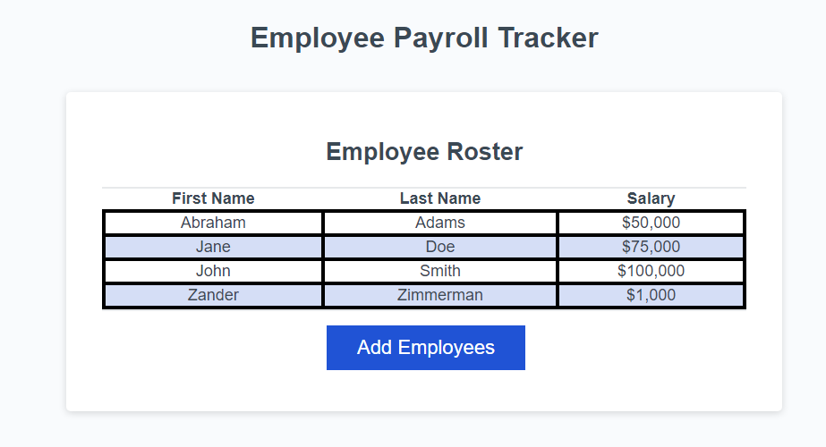
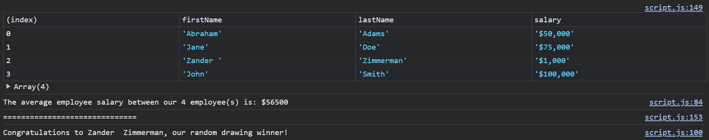
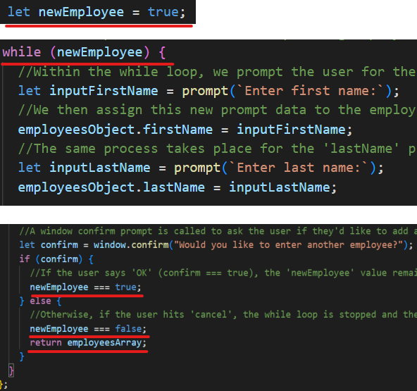
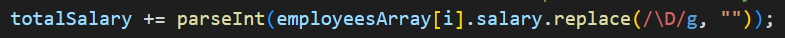

# Coding Bootcamp Challenge 3 - Employee Payroll Tracker by Isaac Fallon

## Description

This project is an employee payroll tracker application built using JavaScript. It serves as the week 3 challenge for The University of Sydney's Coding Bootcamp.

### Screenshot of deployed application (in alphabetical order by last name):

### Screenshot of console logged information about employees (average salary and randomly chosen employee):

- My motivation to complete this project was to ensure a user could enter employee data into a spreadsheet easily on a webpage.
- I built this project as an easy way to store and display employee data in an easily readable format. Additionally, opening the console log reveals the average salary between the employees and picks one out at random for a lucky drawing.
- This application solves a problem of not having a way to enter and display employee data easily. It also sorts the employees alphabetically by last name and logs some useful data about them to the console.
- By completing this project, I learned a lot about how to manipulate an array of objects effectively. I also learned some new methods, like 'Intl.NumberFormat' and '.replace()' which are both used to more effectively manipulate the salary data.

## Installation

N/A

## Usage

If you want to simply access the page easily, [visit the working GitHub Pages link here](https://isaacfallon.github.io/3-Challenge-Employee-Payroll-Tracker/) or by accessing the full link:
https://isaacfallon.github.io/3-Challenge-Employee-Payroll-Tracker/

Alternatively, you can also clone the repository and run the project locally. [Refer to this guide from GitHub if you need help.](https://docs.github.com/en/repositories/creating-and-managing-repositories/cloning-a-repository/)

## Credits

My codebase utilises code found from three external sources:

1. I referenced the following Stack Overflow answer from user 'nathan hayfield' to effectively use a while loop in order to request further inputs form the user: https://stackoverflow.com/questions/14531282/stopping-my-while-loop-with-a-confirm-box

While loop code referenced in my codebase:

2. In order to force a string into a number, I used the syntax from the following MDN web docs link regarding the parseInt() function:
   https://developer.mozilla.org/en-US/docs/Web/JavaScript/Reference/Global_Objects/parseInt

3. In order to strip all non-numeric numbers from a string, I referenced the following Stack Overflow answer from user 'csj' on how to use the replace() method with a regex of '\D': https://stackoverflow.com/questions/1862130/strip-all-non-numeric-characters-from-string-in-javascript

ParseInt() function and replace() method using a regex with the sequence of '\D' to remove all num-numbers in my codebase:

## License

MIT License

Copyright (c) 2024 isaacfallon

Permission is hereby granted, free of charge, to any person obtaining a copy of this software and associated documentation files (the "Software"), to deal in the Software without restriction, including without limitation the rights to use, copy, modify, merge, publish, distribute, sublicense, and/or sell copies of the Software, and to permit persons to whom the Software is furnished to do so, subject to the following conditions:

The above copyright notice and this permission notice shall be included in all copies or substantial portions of the Software.

THE SOFTWARE IS PROVIDED "AS IS", WITHOUT WARRANTY OF ANY KIND, EXPRESS OR IMPLIED, INCLUDING BUT NOT LIMITED TO THE WARRANTIES OF MERCHANTABILITY, FITNESS FOR A PARTICULAR PURPOSE AND NONINFRINGEMENT. IN NO EVENT SHALL THE AUTHORS OR COPYRIGHT HOLDERS BE LIABLE FOR ANY CLAIM, DAMAGES OR OTHER LIABILITY, WHETHER IN AN ACTION OF CONTRACT, TORT OR OTHERWISE, ARISING FROM, OUT OF OR IN CONNECTION WITH THE SOFTWARE OR THE USE OR OTHER DEALINGS IN THE SOFTWARE.
